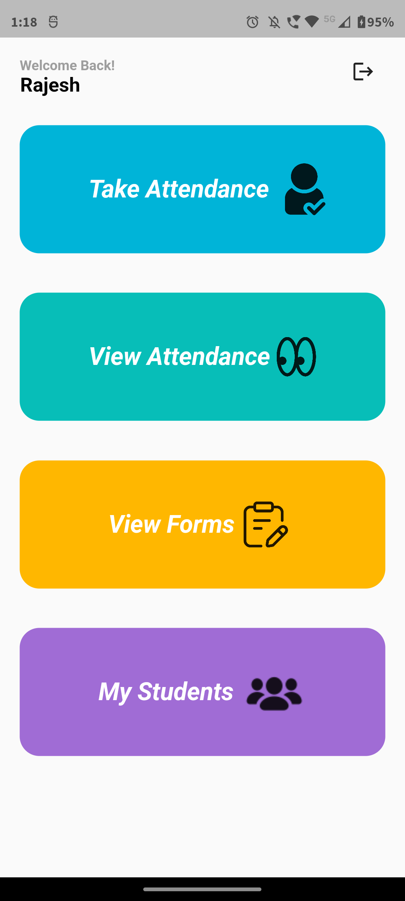

# 📘 Attendance Management System

Download the APK from the **[Releases](https://github.com/Rajesh0408/AttendanceManagementSystem/releases/tag/v1.0.0)** section of this repository and start using the app.  
You can also watch the demo video in **Releases**.


👉 Backend Repository: [AttendanceManagementSystemBackend](https://github.com/Rajesh0408/AttendanceManagementSystemBackend)

---

## ✨ Features

### 👨‍🏫 Faculty / Advisor
- Take attendance for enrolled students.  
- View overall attendance percentage of students in each course taught.  
- Access absence intimation forms submitted by students and **accept/reject** based on the reason.  
- If advisor, manage courses for a particular year:
  - Add new courses.  
  - Enroll students into courses.  
  - View overall attendance for individual students across courses.  

### 🎓 Student
- View overall attendance in all enrolled subjects.  
- Submit **absence intimation forms** to the respective course faculty.  
- Track status of submitted forms (**Accepted / Rejected**).  

---

## 🛠 Tech Stack
- **Frontend:** Flutter  
- **Backend:** Flask (Python) → [Backend Repository](https://github.com/Rajesh0408/AttendanceManagementSystemBackend)  
- **Database:** PostgreSQL  
- **Hosting:** Render  

---


## ⚙️ Installation (for Developers)

If you want to run this project locally:

```bash
# Clone the repository
git clone https://github.com/Rajesh0408/AttendanceManagementSystem.git

# Navigate into the frontend
cd AttendanceManagementSystem/frontend

# Get Flutter packages
flutter pub get

# Run the app in debug mode
flutter run
```
---
Signup and login page:

          

Faculty and Advisor side UI screenshots:

Home page

 
After clicking Take Attendance 

    
